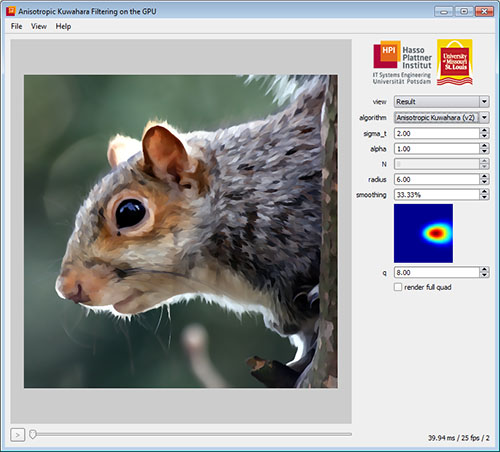

# gpuakf

Image and Video Abstraction by Anisotropic Kuwahara Filtering

This program implements an automatic image and video abstraction technique based on the anisotropic Kuwahara filter. It was written by [Jan Eric Kyprianidis](http://www.kyprianidis.com/) while working as a research scientist for the [computer graphics systems group](http://www.hpi3d.de/) of the [Hasso-Plattner-Institut](http://www.hpi.uni-potsdam.de/) at the University of Potsdam, Germany.

A detailed discussion of the implementation can be found in the GPU Pro book (Kyprianidis & et al., 2010). For more details on technical aspects see (Kyprianidis et al., 2009).

## Building
Building requires the [Qt cross platform toolkit](http://qt-project.org/). Recommended Qt version is 4.7.2. The program has been tested to successfully build with Visual Studio 2008 on Windows, Qt Creator SDK 2.1.0 on Mac OS X and the default toolchain on Ubuntu 10.10. See build.bat/build.sh to get started. Video processing is only available on Mac OS X and Windows and requires Apple QuickTime. The Apple [QuickTime](http://www.apple.com/quicktime) SDK for Windows can be downloaded [here](http://developer.apple.com/quicktime).

## Related Publications
* Kyprianidis, J. E., Kang, H., & Döllner, J. (2009). [Image and Video Abstraction by Anisotropic Kuwahara Filtering](http://www.kyprianidis.com/p/pg2009/). Computer Graphics Forum 28(7). (Special issue on Pacific Graphics 2009)
* Kyprianidis, J. E., Kang, H., & Döllner, J. (2010). [Anisotropic Kuwahara Filtering on the GPU](https://www.kyprianidis.com/p/gpupro/). In W. Engel (Ed.), GPU Pro - Advanced Rendering Techniques. AK Peters.
* Kyprianidis, J. E., Semmo, A., Kang, H., & Döllner, J. (2010). [Anisotropic Kuwahara Filtering with Polynomial Weighting Functions](https://www.kyprianidis.com/p/tpcg2010/). In Proc. EG UK Theory and Practice of Computer Graphics.
